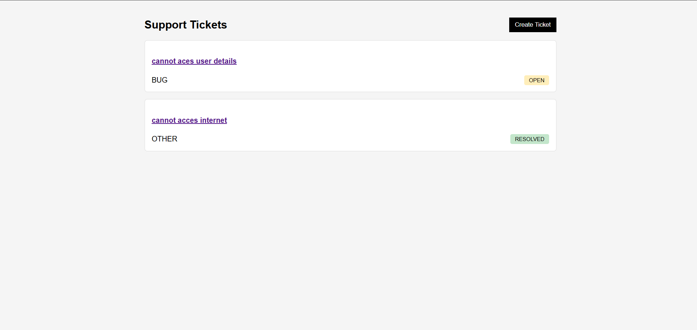
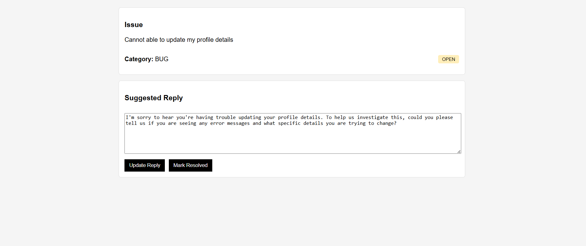

# AI-Powered Support Ticket Assistant

## Overview

This is a full-stack web application that allows users to submit support tickets. The system uses AI to automatically categorize tickets and generate suggested replies.

---

## Features

* Create support tickets
* AI-based category detection (PAYMENT, LOGIN, BUG, OTHER)
* AI-generated professional reply
* Confidence score from AI
* Ticket dashboard
* Ticket detail view
* Update AI reply
* Mark ticket as resolved
* Async AI processing with fallback

---

## Tech Stack

### Frontend

* React (Vite)
* Axios
* React Router DOM

### Backend

* Node.js
* Express.js
* MongoDB Atlas
* Mongoose

### AI MODEL

* Google Gemini (gemini-2.5-flash)

---

## Folder Structure

```
backend/
  config/
  controllers/
  models/
  routes/
  services/
  server.js

frontend/
  src/
    api/
    components/
    pages/
    App.jsx
```


## Project Screenshots
<h2>Dashboard-Page</h2>



<h2>Ticket Detail</h2>



---

## Setup Instructions

### 1. Clone the Repository

```
git clone <your-repo-url>
cd project-folder
```

---

## Backend Setup

```
cd backend
npm install 
```

Create `.env` file:

```
PORT=YOur port 
MONGO_URI=your_mongodb_connection_string
GEMINI_KEY=your_gemini_api_key
```

Run backend:

```
npm run dev / node server.js
```

---

## Frontend Setup

```
cd frontend
npm install

npm run dev
```

---


## AI Output Format

```
{
  "category": "PAYMENT",
  "reply": "We’re sorry for the inconvenience...",
  "confidence": 0.92
}
```

---

## Assumptions

* AI may take a few seconds, so default values are shown initially
* If AI fails, fallback response is used
* No authentication implemented (out of scope)

---


## Deployment

Frontend: Vercel

Backend: Render -  https://ticket-assistant-1.onrender.com/api/tickets

---

## Author

Sarthak Bisht
